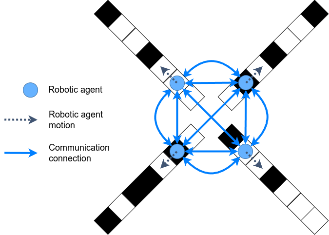
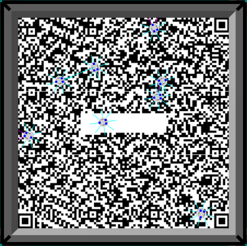

# Sensor Degradation Filters for Minimalistic Collective Perception
## Introduction
This repository provides the code to simulate the experiments shown in [Adaptive Self-Calibration for Minimalistic Collective Perception by Imperfect Robot Swarms](https://arxiv.org/abs/2410.21546).

Two simulators are provided here:
1. Python-based static topology simulator, and
2. ARGoS3-based dynamic topology simulator.

### Static topology simulation
The robots in the static topology simulator do not move in the normal sense and have fixed communication channels with its neighbors (the communication network is specified by the user). In each simulated experiment, a fixed number of robots would traverse their own black and white tile-track and communicate periodically with their neighbors. The figure belows illustrates what it would look like for 4 robots.
<p align="center">

</p>

### Dynamic topology simulation
The robots in the dynamic topology simulator move around a square arena of black and white tiles. In each simulated experiment, a fixed number of robots would randomly move around the arena and communicate with neighbors within their proximity. The figure below is a screenshot of the simulation for 8 robots on a QR code used in the physical experiments.
<p align="center">

</p>

## Requirements
- Python 3.8+, `pip`, and `python3-venv` - _the code here was tested on Python 3.8 (Ubuntu 20.04) and Python 3.12 (Ubuntu 24.04)_
- CMake 3.15+
- [ARGoS3](https://github.com/ilpincy/argos3.git) - _recommended to be built from source_
- [ARGoS3-KheperaIV plugin](https://github.com/ilpincy/argos3-kheperaiv) - _can only be built from source_
- [GSL 2.5+](https://www.gnu.org/software/gsl/) - _can be installed using `apt install libgsl-dev` or built from source_
- [NLopt 2.9.0+](https://github.com/stevengj/nlopt) - _can only be built from source_

## Installation
First, ensure that all requirements are satisfied and clone this repository. Then run the subsequent commands in the project root directory.

### Static topology simulation and data visualization
This optional subsection installs the Python simulator and utilities to visualize the data. You may skip it if you don't intend to run the static topology simulation and prefer to parse the JSON data files with your own code.
1. Create a virtual environment.
    ```
    $ python3 -m venv .venv
    ```
2. Activate the environment and install Python requirements.
    ```
    $ source .venv/bin/activate
    $ pip install -r requirements.txt # python 3.8; if python 3.12 use 'requirements_python3-12.txt' instead
    ```

### Dynamic topology simulation
Make and build the project by doing:
```
$ mkdir build_argos # recommended over 'build' as 'pip install .' uses the 'build' directory
$ cd build_argos
$ cmake ..
$ make
```

## Execution
In both the static and dynamic simulations, the data will be stored as JSON files in an automatically created directory. Each JSON file corresponds to a single trial. The directory name is assigned based on the specified experimental parameters with date and time.

### Static topology experiments
1. Set up the desired experimental parameters as shown [here](docs/parameter_file_setup.md).
2. Activate the Python virtual environment.
    ```
    $ source .venv/bin/activate
    ```
3. Run the simulation.
    ```
    $ run_static_degradation_experiment.py <YML-PARAM-FILE>
    ```
    Script help:
    ```
    usage: run_static_degradation_experiment.py [-h] [-p] [--verbose] FILE

    Execute multi-agent simulation with static topologies and static degradation.

    positional arguments:
    FILE        path to the parameter file relative to the current/execution directory

    options:
    -h, --help  show this help message and exit
    -p          flag to use cores to run simulations in parallel
    --verbose   flag to run with verbose output
    ```

### Dynamic topology experiments
1. Set up the desired experimental parameters as shown [here](docs/parameter_file_setup.md).
2. Run the simulation.
    ```
    $ run_dynamic_topo_simulations -c <ARGOS-PARAM-FILE>
    ```

## Visualization of experiment data
Once the simulation completes, you can parse the JSON data files yourself to visualize the data.

Alternatively, this repository contains utility functions in Python to process and plot the data. The method of choice is to use them in a Jupyter notebook for data visualization. See [here](docs/utility_scripts_functions.md) for detailed instructions on the utility functions.