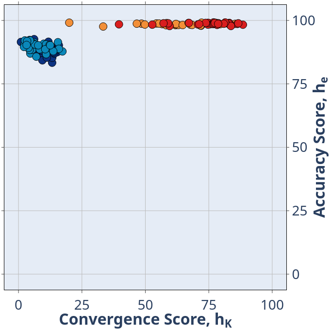
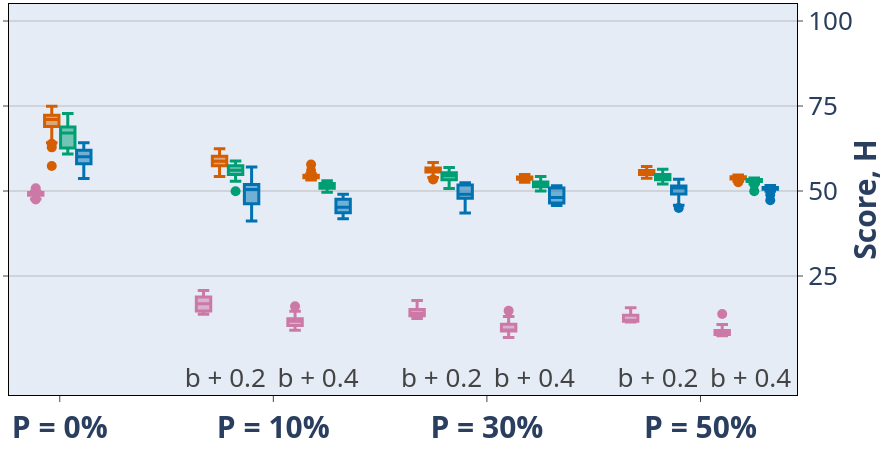
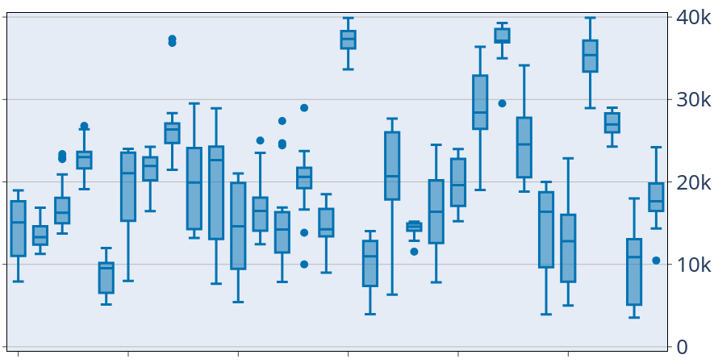

# Utility scripts and functions
This page describes some tools provided in this repository besides those that execute simulated experiments. 

## Python
_This section assumes you have set up the Python virtual environment and installed the repository's Python packages._

### `extract_convergence_accuracy_data` script
This script converts the raw JSON data files into an HDF file which contain a single Pandas DataFrame object. It also computes the convergence time step of the informed estimate for each robot and the absolute error associated with said estimate. You can extract the DataFrame to analyze and visualize the data with your own code or using the provided visualization module (see next subsection).
```
$ extract_convergence_accuracy_data.py <FOLDER-CONTAINING-JSON-DATA> <THRESHOLD>
```
Script help:
```
usage: extract_convergence_accuracy_data.py [-h] [--output OUTPUT] [--key KEY] [--verbose] FOLDER THRESH

Process convergence and accuracy data from simulated experiment data to save into HDF file. The stored data is a Pandas DataFrame.

positional arguments:
  FOLDER           path to the folder containing all the JSON data files; the files can be several levels deep
  THRESH           threshold to assess convergence point

options:
  -h, --help       show this help message and exit
  --output OUTPUT  output filename (default: conv_acc_data.h5)
  --key KEY        dictionary key when storing the Pandas DataFrame (default: "df")
  --verbose        flag to run with verbose output
```

### `scripts.python.static_degradation_viz_module` module
This Python module provides the following functions for you to plot data extracted using the `extract_convergence_accuracy_data.py` script. The list below describes the main functions you'll need for data visualization and is not an exhaustive one.

- `plot_scatter_plotly`: plots a scatter plot
  <details><summary>Example usage:</summary>

    ```python
    fig = plot_scatter_plotly(
        PANDAS_DATAFRAME_OBJ,
        y_key=Y_DATA_KEY_STR,
        x_key=X_DATA_KEY_STR,
        color_key=COLOR_BAR_DATA_KEY_STR,
        category_orders={
            CATEGORY_1_DATA_KEY_STR: [CAT1_1ST_ITEM, CAT1_2ND_ITEM, CAT1_3RD_ITEM, ...],
            CATEGORY_2_DATA_KEY_STR: [CAT2_1ST_ITEM, CAT2_2ND_ITEM, ...],
            ...
        },
        main_tick_font_size=MAIN_TICK_FONT_SIZE_INT,
        y_lim=Y_LIM_LST,
        x_lim=X_LIM_LST,
        x_label_prefix=X_LABEL_PREFIX_STR,
        x_label_suffix=X_LABEL_SUFFIX_STR,
        legend_title={
            "text": LEGEND_TITLE_STR,
            "font": {"size": LEGEND_FONT_SIZE_INT}
        },
        legend_font_size=LEGEND_FONT_SIZE_INT,
        legend_orientation=LEGEND_ORIENTATION_STR,
        legend_trace_group_gap=LEGEND_LABEL_GAP_INT,
        title=PLOT_TITLE_STR,,
        y_title={
            "text": Y_TITLE_STR,
            "font": {"size": Y_TITLE_FONT_SIZE_INT},
            "standoff": Y_TITLE_STANDOFF_INT
        },
        x_title={
            "text": X_TITLE_STR,
            "font": {"size": X_TITLE_FONT_SIZE_INT},
            "standoff": X_TITLE_STANDOFF_INT
        },
        marker={
            "size": MARKER_SIZE_INT,
            "line": {
                "width": MARKER_LINE_WIDTH_INT,
                "color": MARKER_LINE_COLOR_HEX_STR
            }
        },
        y_side="right",
        fig_width=FULL_FIG_WIDTH_INT,
        fig_height=FULL_FIG_HEIGHT_INT,
        output_path=OUTPUT_PATH_STR,
        show_x=True,
        show_y=True,
        show_title=True,
        show_legend=True
    )
    ```
  </details>

  <details><summary>Example output:</summary>
  <p align="center">
  
  </p>
  </details>

- `plot_multix_boxplot_plotly`: plots a boxplot with a major and a minor x-axis.
  <details><summary>Example usage:</summary>

    ```python
    fig = plot_multix_boxplot_plotly(
        PANDAS_DATAFRAME_OBJ,
        y_key=Y_DATA_KEY_STR,
        x1_key=X_MAJOR_DATA_KEY_STR,
        x2_key=X_MINOR_DATA_KEY_STR,
        x2_reverse=False,
        x2_special_val=VALUE_TO_OMIT_X_MINOR_LABEL_FOR_STR,
        color_key=BAR_DATA_KEY_STR,
        box_colors=[
            COLOR_1_HEX_STR,
            COLOR_2_HEX_STR,
            ...
        ],
        x1_spacing=X1_SPACING_INT,
        x2_spacing=X2_SPACING_INT,
        marker_size=MARKER_SIZE_INT,
        category_orders={
            CATEGORY_1_DATA_KEY_STR: [CAT1_1ST_ITEM, CAT1_2ND_ITEM, CAT1_3RD_ITEM, ...],
            CATEGORY_2_DATA_KEY_STR: [CAT2_1ST_ITEM, CAT2_2ND_ITEM, ...],
            ...
        },
        y_lim=Y_LIM_LST,
        y_tick_font_size=Y_TICK_FONT_SIZE_INT,
        x1_tick_font_size=X1_TITLE_FONT_SIZE_INT,
        x2_tick_font_size=X2_TICK_FONT_SIZE_INT,
        y_label_prefix=Y_LABEL_PREFIX_STR,
        y_label_suffix=Y_LABEL_SUFFIX_STR,
        x1_label_prefix=X1_LABEL_PREFIX_STR,
        x1_label_suffix=X1_LABEL_SUFFIX_STR,
        x2_label_prefix=X2_LABEL_PREFIX_STR,
        x2_label_suffix=X2_LABEL_SUFFIX_STR,
        legend_title={
            "text": LEGEND_TITLE_STR,
            "font": {"size": LEGEND_FONT_SIZE_INT}
        },
        title=PLOT_TITLE_STR,
        y_title={
            "text": Y_TITLE_STR,
            "font": {"size": Y_TITLE_FONT_SIZE_INT},
            "standoff": Y_TITLE_STANDOFF_INT
        },
        x1_title={
            "text": X_TITLE_STR,
            "font": {"size": X1_TITLE_FONT_SIZE_INT},
            "standoff": X1_TITLE_STANDOFF_INT
        },
        y_side="right",
        fig_width=FIG_WIDTH_INT,
        fig_height=FIG_HEIGHT_INT,
        fig_scale=FIG_SCALE_INT,
        output_path=OUTPUT_PATH_STR,
        show_x1=True,
        show_y=True,
        show_title=True,
        show_legend=True
    )
    ```
  </details>

  <details><summary>Example output:</summary>
  <p align="center">
  
  </p>
  </details>

- `plot_boxplot_plotly`: plots a regular boxplot.
  <details><summary>Example usage:</summary>

    ```python
    fig = plot_boxplot_plotly(
        PANDAS_DATAFRAME_OBJ,
        y_key=Y_DATA_KEY_STR,
        x_key=X_DATA_KEY_STR,
        color=COLOR_CODE_HEX_STR,
        marker_size=MARKER_SIZE_INT,
        y_lim=Y_LIM_LST,
        y_dtick=Y_DTICK_FLOAT,
        y_tick_font_size=Y_TICK_FONT_SIZE_INT,
        x_tick_font_size=X_TITLE_FONT_SIZE_INT,
        y_label_prefix=Y_LABEL_PREFIX_STR,
        y_label_suffix=Y_LABEL_SUFFIX_STR,
        x_label_prefix=X_LABEL_PREFIX_STR,
        x_label_suffix=X_LABEL_SUFFIX_STR,
        title=PLOT_TITLE_STR,
        y_title={
            "text": Y_TITLE_STR,
            "font": {"size": Y_TITLE_FONT_SIZE_INT},
            "standoff": Y_TITLE_STANDOFF_INT
        },
        x_title={
            "text": X_TITLE_STR,
            "font": {"size": X_TITLE_FONT_SIZE_INT},
            "standoff": X_TITLE_STANDOFF_INT
        },
        y_side="right",
        fig_width=FIG_WIDTH_INT,
        fig_height=FIG_HEIGHT_INT,
        fig_scale=FIG_SCALE_INT,
        output_path=OUTPUT_PATH_STR,
        show_x=True,
        show_y=True,
        show_title=True
    )
    ```
  </details>

  <details><summary>Example output:</summary>
  <p align="center">
  
  </p>
  </details>

## C++ script
_This section assumes you have built the C++ project._

### `compute_wall_positions` script
To test a specific swarm density using the dynamic topology simulator, you need to specify the appropriate wall position to constrain the robots' walkable area, as the following equation describes:

$$ D = \frac{\text{communication area}}{\text{walkable area}} = \frac{N \pi r^2}{L^2} $$

Simply run the `compute_wall_positions.cpp` script and answer the prompts accordingly:

```
$ compute_wall_positions

Please specify the desired number of robots: 25
Please specify the desired swarm density: 10
Please specify the radius of the communication range of the robot in m: 0.7
Please specify the desired wall thickness in m (optional): 0.1
Please specify the desired wall height in m (optional): 0.5
```
Upon completion the script will generate an XML output that you can copy and paste in your `.argos` configuration file.
```xml
Configuration for the .argos file (copy and paste this under the <arena> node):

	<box id="wall_north" size="3.000000, 0.100000, 0.500000" movable="false">
	    <body position="0.000000, 1.030873, 0.000000" orientation="0, 0, 0" />
	</box>
	<box id="wall_south" size="3.000000, 0.100000, 0.500000" movable="false">
	    <body position="0.000000, -1.030873, 0.000000" orientation="0, 0, 0" />
	</box>
	<box id="wall_east" size="0.100000, 3.000000, 0.500000" movable="false">
	    <body position="1.030873, 0.000000, 0.000000" orientation="0, 0, 0" />
	</box>
	<box id="wall_west" size="0.100000, 3.000000, 0.500000" movable="false">
	    <body position="-1.030873, 0.000000, 0.000000" orientation="0, 0, 0" />
	</box>

	<distribute>
	    <position method="uniform" min="-1.030873, -1.030873, 0" max="1.030873, 1.030873, 0" />
	    <orientation method="uniform" min="0, 0, 0" max="0, 0, 0" />
	    <entity quantity="25" max_trials="100" base_num="0">
	        <kheperaiv id="kiv" rab_data_size="50" rab_range="0.700000">
	            <controller config="ksdc" />
	        </kheperaiv>
	    </entity>
	</distribute>
```

## Slurm
_This section assumes that you have ARGoS3 and the ARGoS3-KheperaIV plugin installed on the cluster. If not, you can refer to this [repository](https://github.com/NESTLab/WPI_Cluster_Scripts.git) on how to set it up._

A number of scripts are provided to run batch jobs using the SLURM batch manager on a HPC cluster in `scripts/bash/`:

- `hpc_multi_job_dynamic_topo_extract_conv_acc_data.sh`
- `hpc_multi_job_dynamic_topo_static_deg_run_ALPHA.sh`
- `hpc_multi_job_dynamic_topo_static_deg_run_BRAVO.sh`
- `hpc_multi_job_static_topo_static_deg_run.sh`

Note that the `sbatch_*_topo_static_deg_run.sh` scripts are not meant to be used directly; you should modify any values in the `hpc_multi_job*` scripts that use them. The scripts contain instructions you can read for more info on how to use them.